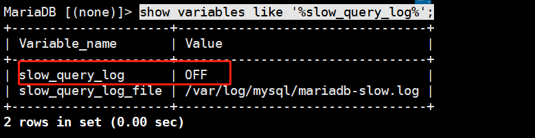
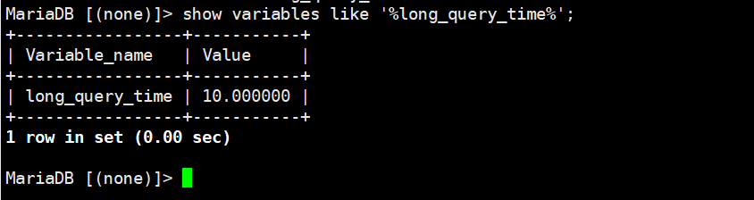

### mysql 数据库优化


### SQL及索引优化：

#### 如何发现有问题的sql?

#### 使用mysql慢查日志对有效率问题的sql进行监控

```
1. 查看mysql是否开启慢查日志
show variables like '%slow_query_log%';

设置开启状态
set global slow_query_log=on;
```



```
2. 查看使用索引查询语句是否开启
show variables like '%log%';

设置开启：
set global log_queries_not_using_indexes = on;
```


```
3. 查看查询时间大于1s的sql语句
show variables like '%long_query_time%';

设置查询时间
set global long_query_time = 1;(大于1s的查询放到慢查询日志中)
```




#### 慢查日志所包含的内容

```
执行sql的主机信息
```

```
SQL的执行信息
```

```
SQL的执行时间
```

```
SQL的内容
```

