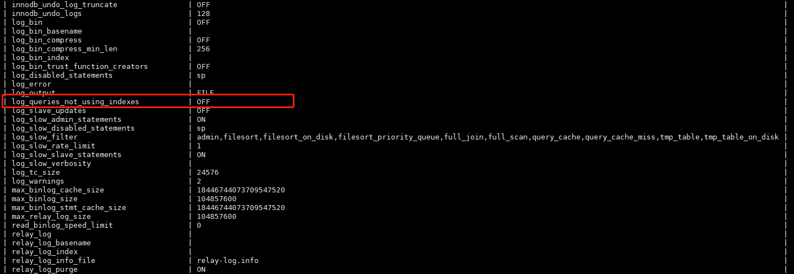

### mysql 数据库优化


### 1. SQL及索引优化：

#### 如何发现有问题的sql?

#### 使用mysql慢查日志对有效率问题的sql进行监控

```
1. 查看mysql是否开启慢查日志
show variables like '%slow_query_log%';

设置开启状态
set global slow_query_log=on;
```


```
2. 查看使用索引查询语句是否开启
show variables like '%log%';

设置开启：
set global log_queries_not_using_indexes = on;
```



```
3. 查看查询时间大于1s的sql语句
show variables like '%long_query_time%';

设置查询时间
set global long_query_time = 1;(大于1s的查询放到慢查询日志中)
```


#### 慢查日志所包含的内容

```
执行sql的主机信息
```

```
SQL的执行信息
```

```
SQL的执行时间
```

```
SQL的内容
```

### 2. 索引创建

#### 分类：

1. 单值索引：
   1. 单列，一个表可以有多个单值索引
2. 主键索引：
   1. 不能重复   不能为null
3. 唯一索引:
   1. 不能重复    可以为null
4. 复合索引:
   1. 多个列构成的索引

#### 创建

```
方式一：
create 索引类型 索引名 on 表（字段）
方式二：
alter table 表名 索引类型 索引名（字段）

单值索引：
create index index_name on table_name(filed_name);
唯一索引：
create unique index index_name on table_name(filed_name);
复合索引：
create index index_name on table_name(filed_name1,filed_name2);

注意：如果一个字段是primary key,则该字段默认就是   主健索引

删除索引：
drop index 索引名 on 表名;
查询表的索引：
show index from 表名;
```


